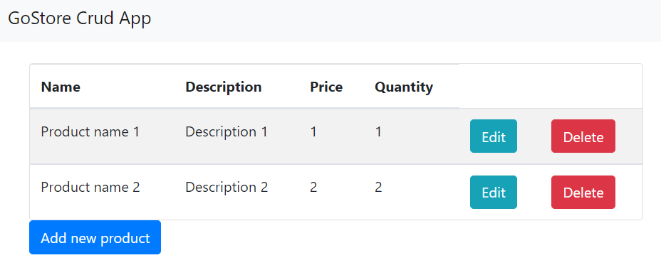

# GoStore Crud App 
> Web application to perform CRUD operation in PostgreSQL.


## Table of Contents
* [General Info](#general-information)
* [Technologies Used](#technologies-used)
* [Screenshot](#screenshot)
* [Setup](#setup)
* [Acknowledgements](#acknowledgements)
* [Contact](#contact)


## General Information
- This project runs a backend local server to expose a simple static html webpage to perform CRUD operation in postgre database.


## Technologies Used
- Golang - version 1.16
- PostgreSQL - version 10.16


## Screenshot



## Setup
* Install [postgreSQL](https://www.postgresql.org/) version 10.
* create a database named: Go_Store
* To create a table run the query
```
create table products (
    id serial primary key,
    product varchar,
    description varchar,
    price decimal,
    quantity integer
)
```

* Clone this repository into your go home path or a separate directory.

Note: _If you are making clone in a separate directory then you have to export your environments._
```bash
$ git clone https://github.com/Felipe-Borba/GoStore-crud-app.git
Gobarber-backend.git
```
* Go to package directory
```bash
$ cd .\GoStore-crud-app\src
```
<!--
* Install dependencies
```bash
$ go ...
```
I could use glide to manage dependencies
 verify that -->

* Run local server
```bash
$ go run main.go
```

* Access project main page
> [https://localhost:8080](https://localhost:8080)


## Acknowledgements
- This project is part of [Alura training course](https://www.alura.com.br/curso-online-go-lang-web).


## Contact
Created by [Felipe Borba](https://github.com/Felipe-Borba) - feel free to contact me!
